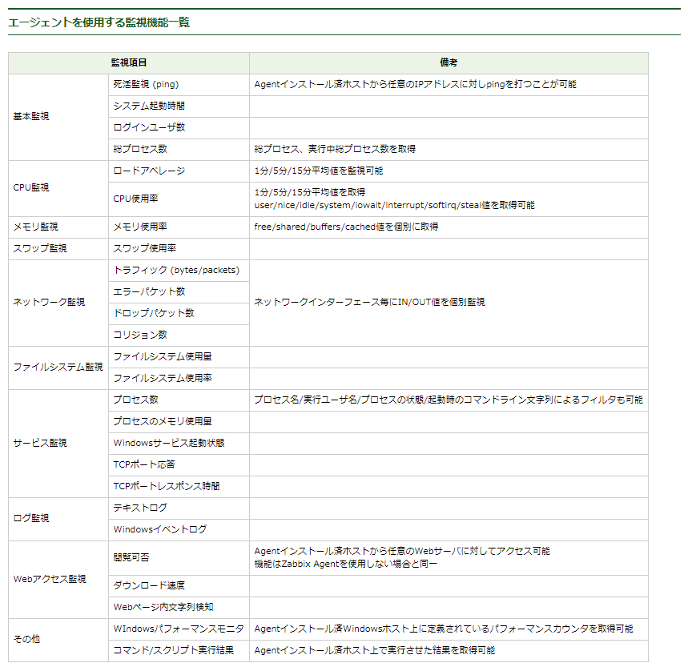
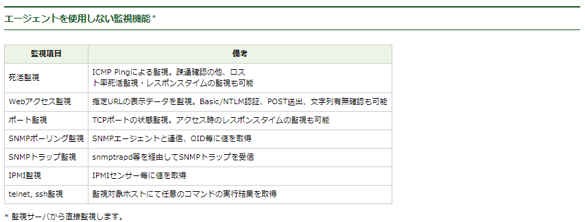

整理
```
HostGroup / Host
              ↑
            Template(ミドルウェア、アプリ)
           　 │
           　 ├── item
           　 │    │ └── triger ── action
           　 │    │ 
           　 │    └──── graph/map/screen/dashbord
           　 │
           　 └── web
```

手順
```
・監視項目を洗い出す。
・監視項目のkeyを洗い出す。ない場合はUserParameterなどで定義。
・ZabbixServerもしくはproxyからのzabbix_getコマンドで値取得を確認。
・ZabbixWebでアイテムの設定。値を取得できることを確認。
・トリガーを設定。テストアラートを発報してみる。
```

洗い出し
```
<Template>
Base
Web_nginx
DB_mysql_master
DB_mysql_slave

defaultでLinux OSテンプレートも設定

---
<Base>
item:
  - Resource:
      - cpu:
        - item:
        - triger:
        - action:

      - LoadAverage:
      - Memory:
      - Disk:
  - Process:
      - sshd:
  - Port:
      - 20:
      - 10050:
  - Log:
      - Zabbix-agent:
  - Other:
      - TimeSync:


<Web_nginx>
item:
    Resource    (CPU,LoadAverage,Memory,Disk)
    Proccess    (sshd,nginx,zabbix-agent,docker)
    Port        (20,80,10050)
    Log         (zabbix_agent,nginx)
    TimeSync    ()

Web_Scenario:
    http://...

<DB_mysql_master>
item:
    Resource    (CPU,LoadAverage,Memory,Disk)
    Proccess    (sshd,mysql,zabbix-agent)
    Port        (20,3306,10050)
    Log         (zabbix_agent,mysql)
    Replication (master status)
    TimeSync    ()

<DB_mysql_slave>
item:
    Resource    (CPU,LoadAverage,Memory,Disk)
    Proccess    (sshd,mysql,zabbix-agent)
    Port        (20,3306,10050)
    Log         (zabbix_agent,mysql)
    Replication (slave status)
    TimeSync    ()
```

- アイテム
```
--------------------------------------------------------------------
<Basic Template>
    system.cpu.util[,user] ×
    item MYK Load Average 15min   : system.cpu.load[,avg1]
    item MYK Memory size          : vm.memory.size[free]
    item MYK Disk Size            :vfs.fs.size[/,pused]

    item MYK process SSHD         : proc.num[sshd]
    item MYK port 22              : net.tcp.listen[22]

    item MYK log Zbx Agent        : log[/var/log/zabbix/zabbix_agentd.log]  type=>Zabbix Agent(Active)
    trgr MYK log zbx Agent "error": {Basic Template:log[/var/log/zabbix/zabbix_agentd.log].str(error)}=0

    item MYK Local Time Sync      : system.localtime
    trgr MYK Time Sync diff 3s    : {Basic Template:system.localtime.fuzzytime(3)}=0 
--------------------------------------------------------------------
<Web Template>
    item MYK process HTTP       : proc.num[http]
    item MYK port 80            : net.tcp.listen[80]

    item MYK Nginx access log   : log[/var/log/nginx/access.log] (今回dockerなので無効化)
    item MYK Nginx error log    : log[/var/log/nginx/error.log]　(今回dockerなので無効化)

--------------------------------------------------------------------
<Mysql master Template>
    item MYK mysqk $1で指定↓
    item MYK mysql Seconds_Behind_Master : mysql.slave.status[Seconds_Behind_Master]
    item MYK mysql Read_Master_Log_Pos   : mysql.slave.status[Read_Master_Log_Pos]
    item MYK mysql Master_Log_File       : mysql.slave.status[Master_Log_File]
    item MYK mysql Slave_SQL_Running     : mysql.slave.status[Slave_SQL_Running]
    item MYK mysql Slave_IO_Running      : mysql.slave.status[Slave_IO_Running]

    item MYK process MySQL      : proc.num[mysql]
    item MYK port 3306          : net.tcp.listen[3306]

    item MYK Mysql error log    : log[/var/log/mysqld.log]

--------------------------------------------------------------------
<Mysql slave Template>
    item MYK mysqk $1で指定↓
    item MYK mysqk File         : mysql.master.status[File]
    item MYK mysqk Position     : mysql.master.status[Position]

    item MYK process MySQL      : proc.num[mysql]
    item MYK port 3306          : net.tcp.listen[3306]

    item MYK Mysql error log    : log[/var/log/mysqld.log]

--------------------------------------------------------------------
```


- トリガー
```
--------------------------------------------------------------------
<Basic Template>
    item MYK Load Average 15min : system.cpu.load[,avg15]
    MYK avg15 {A_Template_OS_Linux:system.cpu.load[,avg15].last()}>2


    item MYK Memory size        : vm.memory.size[free]
    障害の条件式 {Template OS Linux:vm.memory.size[free].last(#3)}>=90
    復旧の条件式 {Template OS Linux:vm.memory.size[free].last(#3)}<80


    item MYK Disk Size          :vfs.fs.size[/,pused]
    triger: {Template OS Linux:vfs.fs.size[/,pused].last(0)}>80


    item MYK process SSHD       : proc.num[sshd]
    item MYK port 22            : net.tcp.listen[22]

    item MYK log Zbx Agent      : log[/var/log/zabbix/zabbix_agentd.log]  type=>Zabbix Agent(Active)

--------------------------------------------------------------------
<Web Template>
    item MYK process HTTP       : proc.num[http]
    item MYK port 80            : net.tcp.listen[80]

    item MYK Nginx access log   : log[/var/log/nginx/access.log] (今回dockerなので無効化)
    item MYK Nginx error log    : log[/var/log/nginx/error.log]　(今回dockerなので無効化)

--------------------------------------------------------------------
<Mysql master Template>
    item MYK mysqk $1で指定↓
    item MYK mysql Seconds_Behind_Master : mysql.slave.status[Seconds_Behind_Master]
    item MYK mysql Read_Master_Log_Pos   : mysql.slave.status[Read_Master_Log_Pos]
    item MYK mysql Master_Log_File       : mysql.slave.status[Master_Log_File]
    item MYK mysql Slave_SQL_Running     : mysql.slave.status[Slave_SQL_Running]
    item MYK mysql Slave_IO_Running      : mysql.slave.status[Slave_IO_Running]

    item MYK process MySQL      : proc.num[mysql]
    item MYK port 3306          : net.tcp.listen[3306]

    item MYK Mysql error log    : log[/var/log/mysqld.log]

--------------------------------------------------------------------
<Mysql slave Template>
    item MYK mysqk $1で指定↓
    item MYK mysqk File         : mysql.master.status[File]
    item MYK mysqk Position     : mysql.master.status[Position]

    item MYK process MySQL      : proc.num[mysql]
    item MYK port 3306          : net.tcp.listen[3306]

    item MYK Mysql error log    : log[/var/log/mysqld.log]

--------------------------------------------------------------------
```

-----------------------------------------
# 死活監視
-----------------------------------------
## リソース監視
##### CPU, ロードアベレージ, メモリ, ディスク使用率
```
<CPU>
$ vmstatコマンドで監視すべき項目を確認       https://densan-hoshigumi.com/server/zabbix-linux-cpu-monitoring
procs   ------cpu-----  -----------memory----------  ---swap--  -----io----  -system-- 
 r  b   us sy id wa st    swpd   free   buff  cache    si   so     bi    bo    in   cs 
 0  0    0  0 99  0  0       0 268512   2088 341032     0    0      9   142   101  176  

item  : system.cpu.util[,user]
triger: 障害の条件式 {Template OS Linux:system.cpu.util[,user].last(#3)}>=90
        復旧の条件式 {Template OS Linux:system.cpu.util[,user].last(#3)}<80

<ロードアベレージ>
item  : key: system.cpu.load[,avg1]     => データ型は浮動小数点。1分(avg1)、5分(avg5)、15分(avg15)から選択できる
triger: {A_Template_OS_Linux:system.cpu.load[,avg1].last()}>2

<メモリ>
item  : vm.memory.size[free]            https://it-study.info/network/zabbix/zabbix-monitoring-memory/
        system.swap.size[,free]
triger: 障害の条件式 {Template OS Linux:vm.memory.size[free].last(#3)}>=90
        復旧の条件式 {Template OS Linux:vm.memory.size[free].last(#3)}<80

<ディスク使用率>
item  : vfs.fs.size[/,pused]
triger: {Template OS Linux:vfs.fs.size[/,pused].last(0)}>80
```

## プロセス監視
##### sshd、zabbix-agent、ミドルなど
```
item  : proc.num[sshd] , proc.num[zabbix-agent] , proc.num[mysql] , proc.num[nginx]
triger: 
```
## ポート監視
##### sshd、zabbix-agent、ミドルなど
```
item  : net.tcp.listen[port]    (netstat -an)
        net.tcp.port[<ip>,port] (telnet localhost 80) ※外部指定ではなく、1サーバ内に複数インターフェース(IPアドレス)がある環境でどのインターフェースか指定する場合に使用
```

## サービス接続監視
```
item  : net.tcp.service[service,<ip>,<port>]
　　   （service：ssh, ntp, ldap, smtp, ftp, http, pop, nntp, imap, tcp, https, telnet）
       正常性判断。TCP/IPの階層モデルで言うと、net.tcp.portはトランスポート層（レイヤー4）、net.tcp.service、net.tcp.dnsはアプリケーション層（レイヤー5)でのチェック
```

## Web監視
```
・Webシナリオ監視
　　”監視サーバから”接続確認を行う。
　　複数ページを横断してアクセスしてチェック出来る。
　　認証が必要なサイトであっても、標準認証、または標準的なPOPによるチェックであれば認証をパスしてチェックが出来る。

・web.page.get[host,<path>,<port>]
・web.page.perf[host,<path>,<port>]
・web.page.regexp[host,<path>,<port>,<regexp>,<length>,<output>]
　　Webサイトへの接続チェックを行う。
　　シナリオ監視は行えないが、エージェントから直接httpサイトへチェックを行うことが出来る。
　　（DMZ内にあるWebサーバのサイトチェックを行う場合、監視サーバ<=>監視対象サーバ間でhttp(s)ポートを開けなくても良い）
```

## ログ監視
##### たとえば、mysqlのログとか
```
/etc/my.cnfで確認

errorログ
SlowQueryログ
詳細ログ
バイナリログ
debugログ
```

-----------------------------------------
# その他
-----------------------------------------
##### ファイルが存在するか。しなかったらアラート
```
zabbix_agentd.conf/
AllowRoot=1          # セキュリティ上ダメなら https://tech-mmmm.blogspot.com/2018/03/zabbixallowroot1varlogmessages.html

zabbix_web/
item   : vfs.file.exists[/home/ec2-user/msp/check.txt]
triger : {Zabbix agent:vfs.file.exists[/home/ec2-user/msp/check.txt].last()}=0
```

##### logの中にerrorの文字が出てきたらアラート
```
zabbix_web/
item   : log[/var/log/zabbix/test.log]  ※type: Agent(active), data: log, application: none
triger : (({Zabbix agent:log[/var/log/zabbix/test.log].regexp(error)})<>0) →GUI作成
```

##### Dockerのversionを出力
```
zabbix_agentd.conf/
EnableRemoteCommands=1                       # コマンドの実行を許可（デフォルト: disabled）
UserParameter=docker.ver,/usr/bin/docker -v  # 実行するコマンド（キー,コマンド）

zabbix_web/
item   : docker.ver
```

##### 時刻同期できてるか
```
Linux/
まずは日本時間に設定  https://public-constructor.com/ec2-amazon-linux2-timezone/

zabbix_web/
item: {Template OS Linux:system.localtime.fuzzytime(30)}=0
      
# 確認は「=1」として同期してたらエラーを出す  # Server全てに関係するのでTemplate指定
```

##### Web外形監視
```
web_sg/
inbound: web側のsgでzabbixサーバーからの80アクセスを許可

zabbix_web/
web scenario: http://<web_ip:port>指定 
triger      : {Zabbix agent:web.test.fail[<Web_scenario_name>].last()}>0  -> 問題がな買ったら0が返ってくるので
```

##### MySQLレプリケーション監視
参考 https://blog.apar.jp/zabbix/3218/ ★
```
・監視項目をマスター/スレーブで決める
・エージェント用MySQLユーザー作成
・エージェントがログインするためのパスワードファイル作成
・agent.confファイル編集
・マスター/スレーブ/zabbix_serverのそれぞれで値が取れるか確認

zabbix_web/
item   : mysql.slave.status[Slave_IO_Running]
triger : {<Template_name>:mysql.slave.status[Slave_IO_Running].regexp(Yes)}=0
```


# Preference



# 課題
```
ネットワークディスカバリによるホストの自動登録
```

