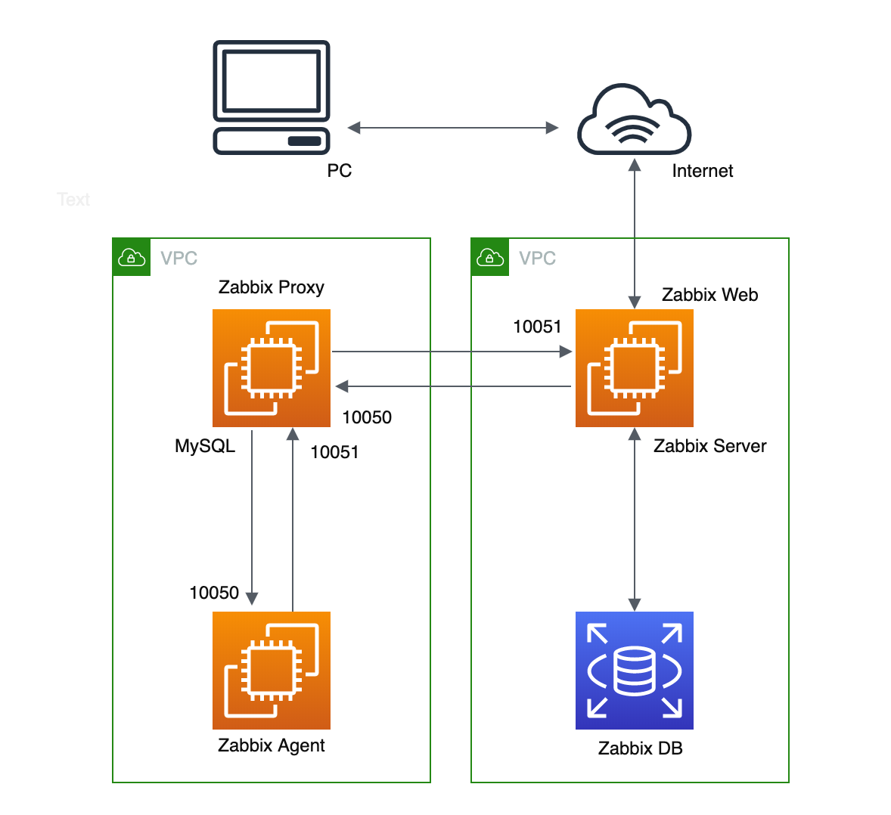

# Architecture



# Create Resources

```
./terraform/

$ terraform init
$ terraform plan
$ terraform apply
```
./terraform_test/はテスト用。


# Provisioning Zabbix_Server

Zabbix_server_instance内
```
$ sudo yum -y update

<!-- $ sudo vi /etc/selinux/config -> SELINUX=disabled -->
<!-- $ sudo reboot -->

$ sudo rpm -Uvh https://repo.zabbix.com/zabbix/4.2/rhel/7/x86_64/zabbix-release-4.2-2.el7.noarch.rpm

$ sudo yum -y install zabbix-server-mysql zabbix-web-mysql zabbix-web-japanese zabbix-agent

$ sudo yum -y install mysql mysql-devel

$ sudo mysql -u RDSユーザー -h RDSエンドポイント -p
  > create database zabbix character set utf8 collate utf8_bin;
  > create user 'zabbix'@'%' identified by 'password';
  > grant all on zabbix.* to 'zabbix'@'%';
  > flush privileges;
  > quit;

$ sudo zcat /usr/share/doc/zabbix-server-mysql*/create.sql.gz | mysql -u RDSユーザー -h RDSエンドポイント -p zabbix

$ sudo vi /etc/zabbix/zabbix_server.conf
    DBHost=RDSエンドポイント
    DBPassword=RDSパスワード

$ sudo vi /etc/php.ini
    date.timezone = Asia/Tokyo
    
$ sudo systemctl start httpd
$ sudo systemctl enable httpd
$ sudo systemctl start zabbix-server
$ sudo systemctl enable zabbix-server
$ sudo systemctl start zabbix-agent
$ sudo systemctl enable zabbix-agent
```
<br>

ブラウザ（http:// ZabbixサーバーパブリックIP /zabbix）
```
# Welcome to Zabbix
  -> Next Step

# Check of pre-requisites
  -> Next Step

# Configure DB connection
    Database host : RDSエンドポイント
    Database port : 0
    Database name : zabbix
    User          : zabbix
    Password      : 作成したdatabaseのzabbixユーザのパスワード
  -> Next Step

# Zabbix server details
    Host : localhost
    Port : 10051
    Name : 
  -> Next Step

# Pre-installation summary
# Congratulations! You have successfully installed Zabbix frontend.
```
初期ユーザー   : Admin
初期パスワード : zabbix
でログイン。

HOMEで障害・深刻度：Zabbix agent on Zabbix server is unreachable for 5 minutes
-> server側のagent起動してるか確認。
<br>


# Provisioning Zabbix_Agent

Zabbix_agent_instance内
```
$ sudo yum -y update

<!-- $ sudo vi /etc/selinux/config -> SELINUX=disabled -->
<!-- $ sudo reboot -->

$ sudo rpm -Uvh https://repo.zabbix.com/zabbix/4.2/rhel/7/x86_64/zabbix-release-4.2-2.el7.noarch.rpm

$ sudo yum -y install zabbix-agent

$ sudo vi /etc/zabbix/zabbix_agentd.conf
    Server      =< Zabbix_Server_PublicIP >
    ServerActive=< Zabbix_Server_PublicIP > ※ or Zabbix_Proxy_PublicIP
    https://www.zabbix.com/documentation/2.2/jp/manual/appendix/config/zabbix_agentd

$ sudo systemctl start zabbix-agent
$ sudo systemctl enable zabbix-agent
```
<br>

ブラウザ（http:// ZabbixサーバーパブリックIP /zabbix）
```
# HOME
  設定 -> ホスト -> ホストの作成クリック
    ホスト名  : 任意
    表示名    : 任意
    グループ  : Linux servers
    IPアドレス: Zabbix Agent側のIPアドレス(PrivateIP)

　-> テンプレートクリック
    テンプレートとのリンク: Template OS Linux

  -> 追加クリック
```

Private Subnet内の監視を想定し、PrivateIPを設定。

障害・深刻度：Lack of free swap space on agent
→ インスタンスタイプ t2.microではメモリが足らないらしい。
→ Swap作成
<br>


# Swap領域
```
[ec2-user@ip-10-10-10-10 ~]$ du -h
4.0K	./.ssh
20K	.

[ec2-user@ip-10-10-10-10 ~]$ free
              total        used        free      shared  buff/cache   available
Mem:        1006968      253972      184952        1288      568044      590544
Swap:             0           0           0

[ec2-user@ip-10-10-10-10 ~]$ cat /proc/meminfo | grep -i swap
SwapCached:            0 kB
SwapTotal:             0 kB
SwapFree:              0 kB

[ec2-user@ip-10-10-10-10 ~]$ df -l
ファイルシス   1K-ブロック    使用  使用可 使用% マウント位置
devtmpfs            485472       0  485472    0% /dev
tmpfs               503484       0  503484    0% /dev/shm
tmpfs               503484     424  503060    1% /run
tmpfs               503484       0  503484    0% /sys/fs/cgroup
/dev/xvda1         8376300 1592920 6783380   20% /
tmpfs               100700       0  100700    0% /run/user/1000


[ec2-user@ip-10-10-10-10 ~]$ sudo dd if=/dev/zero of=/swapfile1 bs=1M count=512
512+0 レコード入力
512+0 レコード出力
536870912 バイト (537 MB) コピーされました、 5.02762 秒、 107 MB/秒

[ec2-user@ip-10-10-10-10 ~]$ sudo chmod 600 /swapfile1

[ec2-user@ip-10-10-10-10 ~]$ sudo mkswap /swapfile1
スワップ空間バージョン 1 を設定します。サイズ = 512 MiB (536866816 バイト)
ラベルはありません, UUID=b0f2ecf5-041e-4d6b-b6bc-574d34218aba

[ec2-user@ip-10-10-10-10 ~]$ sudo swapon /swapfile1

[ec2-user@ip-10-10-10-10 ~]$ sudo sh -c 'echo "/swapfile1  none        swap    sw              0   0" >> /etc/fstab'


[ec2-user@ip-10-10-10-10 ~]$ free
              total        used        free      shared  buff/cache   available
Mem:        1006968      245292       84144        1288      677532      600592
Swap:        524284           0      524284
```
<br>
メモリ不足解決を確認


# Provisioning Zabbix_Proxy

```
$ sudo yum -y update

$ sudo rpm -Uvh https://repo.zabbix.com/zabbix/4.2/rhel/7/x86_64/zabbix-release-4.2-2.el7.noarch.rpm

$ sudo yum install -y zabbix-proxy-mysql


mysql
$ sudo rpm -ivh  https://dev.mysql.com/get/mysql57-community-release-el7-9.noarch.rpm

$ sudo yum -y install --enablerepo=mysql57-community mysql-community-server

$ sudo systemctl start mysqld

$ sudo cat /var/log/mysqld.log
  -> 初期パスワード確認 -> 今回は初期パスを本パスでも使用（規約が厳しいため）->outputファイルに記述
  [Server] A temporary password is generated for root@localhost: [初期パスワード]

$ mysql_secure_installation
  参考: https://weblabo.oscasierra.net/mysql-57-init-setup/
  -> Your password does not satisfy the current policy requirements
  -> パスワード規約が厳しいので初期パスをそのまま使用

$ mysql -uroot -p
  >password: 設定したパスワード
  > create database zabbix_proxy character set utf8 collate utf8_bin;
  > grant all on zabbix_proxy.* to zabbix@localhost identified by '<パスワード(初期パス)>';
    -> 普段は問題ないのに...ここもパスワード規約が厳しいので初期パスをそのまま使用
  > quit;

$ zcat /usr/share/doc/zabbix-proxy-mysql*/schema.sql.gz | mysql -uroot -p zabbix_proxy
  >password: パスワード(初期パス)


$ sudo vi /etc/zabbix/zabbix_proxy.conf
  > ProxyMode=0
  > Server=<Zabbix ServerサーバのIPアドレス>
  > DBPassword=<パスワード(初期パス)>

$ sudo systemctl start zabbix-proxy
$ sudo systemctl enable zabbix-proxy
```


# アラートを確認
stressツール
```
$ wget http://ftp.riken.jp/Linux/dag/redhat/el7/en/x86_64/rpmforge/RPMS/stress-1.0.2-1.el7.rf.x86_64.rpm

$ sudo rpm -ivh stress-1.0.2-1.el7.rf.x86_64.rpm

$ rpm -qa|grep stress

$ stress --version

$ stress -c 1 -q &
    -c: CPU
    -d: I/O
    -m: Memory

$ top

$ pkill stress
```


# 修正点
1. Yumのupdateなどでバージョンの勝手な変更が起きないよう、Zabbixのリポジトリを無効化するべき
```
$ vi /etc/yum.repos.d/zabbix.repo
[zabbix]
...
enabled=0

[zabbix-non-supported]
...
enabled=0
```

2. 編集するファイルはオリジナルコピーを作成している例があった。
```
$ cp -p /etc/zabbix/zabbix_proxy.conf /etc/zabbix/zabbix_proxy.conf.org
```

3. Terraform問題点
Elastic Block StoreがTerraform destroyコマンドで削除されてない。
作成時によしなに作られているのかも。きちんと別リソースとして定義できる？

4. zabbix-agentの再起動
zabbix-webで疎通が取れない、ネットワーク設定もした場合、上記を疑ってみる。

# 参考
AWSのEC2とRDSを利用してZabbix4.2を導入する
https://qiita.com/yuichi1992_west/items/6c81a0e69ea9e7e86d83

AWS上でCentOS 7にZabbix 3.2を構築してみた
https://dev.classmethod.jp/articles/aws-centos7-zabbix3_2-setup/
https://dev.classmethod.jp/articles/aws-centos7-zabbix3_2-proxy-setup/

# 最後に
備忘録
.png)