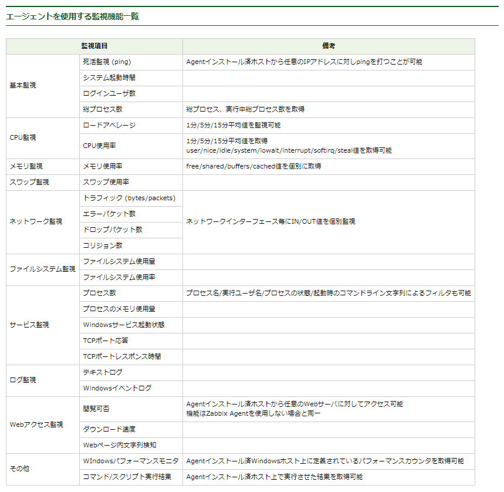
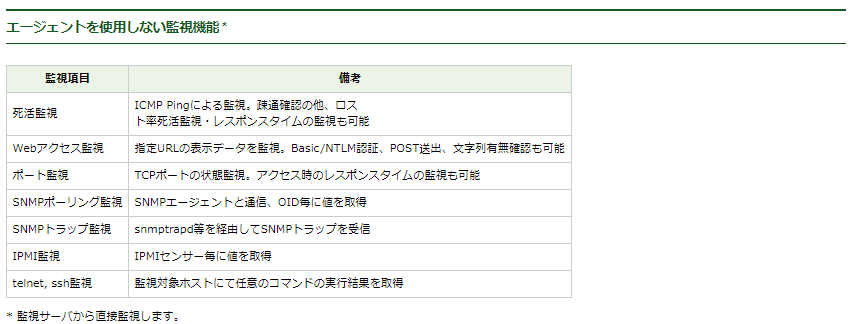

# Construction
```
<Construction>
HostGroup / Host
              ↑
            Template(ミドルウェア、アプリ)
              ↑
            Application(cpu, memory, log... )
           　 │
           　 ├── item
           　 │    │ └── triger ── action
           　 │    │ 
           　 │    └──── graph/map/screen/dashbord
           　 │
           　 └── web
```


　

# Definition
- Host
```
1. Web_Nginx_Server       : Template{Linux_OS, Basic, Web_Nginx}
2. DB_MySQL_Master_Server : Template{Linux_OS, Basic, DB_MySQL_Master}
3. DB_MySQL_Slave_Server  : Template{Linux_OS, Basic, DB_MySQL_Slave}
```

- Template
```
--------------------------------------------------------------------
Template Basic
--------------------------------------------------------------------
[item]
    cpu                : system.cpu.util[,user]  × Linux_OSで定義済
    Load Average 15min : system.cpu.load[,avg15]
    Memory size        : vm.memory.size[free]
    Disk Size          : vfs.fs.size[/,pused]
    process SSHD       : proc.num[sshd]
    port 22            : net.tcp.listen[22]
    log Zbx Agent      : log[/var/log/zabbix/zabbix_agentd.log]  (※Active)
    Local Time Sync    : system.localtime        × Linux_OSで定義済

[triger]
    cpu over 80%            : { * :system.cpu.util[,user].last(#3)}>80  復旧 <60  × Linux_OSで定義済
    Load Average 15min > 2  : { * :system.cpu.load[,avg15].last()}>2    復旧 <0
    Disk Size over 80%      : { * :vfs.fs.size[/,pused].last()}>80      復旧 <60
    prosess SSHD non-active : { * :proc.num[sshd].last()}=0             復旧 =1
    port 22 close           : { * :net.tcp.listen[22].last()}=0         復旧 =1

    Time Sync diff 3s       : { * :system.localtime.fuzzytime(3)}=0               × Linux_OSで定義済
    Agent log "error" 5/10m : { * :log[/var/log/zabbix/zabbix_agentd.log].str("error")}=1
                              and
                              { * :log[/var/log/zabbix/zabbix_agentd.log].count(10m,"error")}>5
    Agent log nodata 5m     : { * :log[/var/log/zabbix/zabbix_agentd.log].nodata(5m)}=0
                              # Check ActiveCheck (RefreshActiveChecks: default 120s)
--------------------------------------------------------------------
Template Web_Nginx
--------------------------------------------------------------------
[item]
    process HTTP     : proc.num[nginx]
    port 80          : net.tcp.lisWeb
    Nginx access log : log[/var/log/nginx/access.log] (※Active)(今回dockerなので無効化)
    Nginx error log  : log[/var/log/nginx/error.log]　(※Active)(今回dockerなので無効化)

[triger]
    prosess Nginx non-active : { * :proc.num[sshd].last()}=0       復旧 =1
    port 80 close            : { * :net.tcp.listen[22].last()}=0   復旧 =1
    log ...今回コンテナなので略（標準出力でファイルに書きだして、そこを読むようにするべきか）

--------------------------------------------------------------------
Template DB_MySQL_master
--------------------------------------------------------------------
[item]
    mysql $1で指定↓
    mysql File       : mysql.master.status[File]
    mysql Position   : mysql.master.status[Position]

    process MySQL    : proc.num[mysqld]
    port 3306        : net.tcp.listen[3306]
    Mysql error log  : log[/var/log/mysqld.log]  (※Active)

[triger]
    Master status [File] ≒ [ip-10-0-21-20-bin...] : { * :mysql.master.status[File].str(File: ip-10-0-21-20-bin)}=0  復旧 =1
    Master status [Position] ≒ [Position...]      : { * ::mysql.master.status[Position].str(Position)}=0            復旧 =1
    process MySQL non-active                       : { * :proc.num[mysqld].last()}=0      復旧 =1
    port 3306 listen close                         : { * :net.tcp.listen[3306].last()}=0  復旧 =1
    Mysql error log alert [error]                  : { * :log[/var/log/mysqld.log].str(error)}=1  (※Active)

--------------------------------------------------------------------
Template DB_MySQL_slave
--------------------------------------------------------------------
[item]
    $1で指定↓
    Seconds_Behind_Master : mysql.slave.status[Seconds_Behind_Master]
    Read_Master_Log_Pos   : mysql.slave.status[Read_Master_Log_Pos]   結果→「4379785」など。どうアラート設定するのか？
    Master_Log_File       : mysql.slave.status[Master_Log_File]
    Slave_SQL_Running     : mysql.slave.status[Slave_SQL_Running]
    Slave_IO_Running      : mysql.slave.status[Slave_IO_Running]

    process MySQL   : proc.num[mysql]
    port 3306       : net.tcp.listen[3306]
    Mysql error log : log[/var/log/mysqld.log]  (※Active)

[triger]
    Slave status behind ≒ [0]                   : { * :mysql.slave.status[Seconds_Behind_Master].str(0)}=0
    Slave status Log_Pos ≒ [number]             : { * :mysql.slave.status[Read_Master_Log_Pos]...???
    Slave status Log_File ≒ [ip-10-0-21-20-bin] : { * :mysql.slave.status[Master_Log_File].str(ip-10-0-21-20-bin)}=0
    Slave status SQL_Running ≒ [Yes]            : { * :mysql.slave.status[Slave_SQL_Running].str(Yes)}=0
    Slave status IO_Running ≒ [Yes]             : { * :mysql.slave.status[Slave_IO_Running].str(Yes)}=0  .regexp(Yes)}=0の方がいいか？

    process MySQL non-active                     : { * :proc.num[mysqld].last()}=0      復旧 =1
    port 3306 listen close                       : { * :net.tcp.listen[3306].last()}=0  復旧 =1
    Mysql error log [error]                      : { * :log[/var/log/mysqld.log].str(error)}=1  (※Active)
--------------------------------------------------------------------
```

# 個別テスト
## リソース監視
##### CPU, ロードアベレージ, メモリ, ディスク使用率
```
<CPU>
    $ vmstatコマンドで監視すべき項目を確認       https://densan-hoshigumi.com/server/zabbix-linux-cpu-monitoring
    procs   ------cpu-----  -----------memory----------  ---swap--  -----io----  -system-- 
    r  b   us sy id wa st    swpd   free   buff  cache    si   so     bi    bo    in   cs 
    0  0    0  0 99  0  0       0 268512   2088 341032     0    0      9   142   101  176  

    item  : system.cpu.util[,user]
    triger: 障害の条件式 {Template OS Linux:system.cpu.util[,user].last(#3)}>=90
            復旧の条件式 {Template OS Linux:system.cpu.util[,user].last(#3)}<80

<ロードアベレージ>
    item  : key: system.cpu.load[,avg1]     => データ型は浮動小数点。1分(avg1)、5分(avg5)、15分(avg15)から選択できる
    triger: {A_Template_OS_Linux:system.cpu.load[,avg1].last()}>2

<メモリ>
    item  : vm.memory.size[free]            https://it-study.info/network/zabbix/zabbix-monitoring-memory/
            system.swap.size[,free]
    triger: 障害の条件式 {Template OS Linux:vm.memory.size[free].last(#3)}>=90
            復旧の条件式 {Template OS Linux:vm.memory.size[free].last(#3)}<80

<ディスク使用率>
    item  : vfs.fs.size[/,pused]
    triger: {Template OS Linux:vfs.fs.size[/,pused].last(0)}>80
```

## プロセス監視
##### sshd、zabbix-agent、ミドルなど
```
item  : proc.num[sshd] , proc.num[zabbix-agent] , proc.num[mysql] , proc.num[nginx]
triger: proc.num[sshd]
```
## ポート監視
##### sshd、zabbix-agent、ミドルなど
```
item  : net.tcp.listen[port]    (netstat -an)
        net.tcp.port[<ip>,port] (telnet localhost 80) ※外部指定ではなく、1サーバ内に複数インターフェース(IPアドレス)がある環境でどのインターフェースか指定する場合に使用
```

## サービス接続監視
```
item  : net.tcp.service[service,<ip>,<port>]
　　   （service：ssh, ntp, ldap, smtp, ftp, http, pop, nntp, imap, tcp, https, telnet）
       正常性判断。TCP/IPの階層モデルで言うと、net.tcp.portはトランスポート層（レイヤー4）、net.tcp.service、net.tcp.dnsはアプリケーション層（レイヤー5)でのチェック
```

## Web監視
```
・Webシナリオ監視
　　”監視サーバから”接続確認を行う。
　　複数ページを横断してアクセスしてチェック出来る。
　　認証が必要なサイトであっても、標準認証、または標準的なPOPによるチェックであれば認証をパスしてチェックが出来る。

・web.page.get[host,<path>,<port>]
・web.page.perf[host,<path>,<port>]
・web.page.regexp[host,<path>,<port>,<regexp>,<length>,<output>]
　　Webサイトへの接続チェックを行う。
　　シナリオ監視は行えないが、エージェントから直接httpサイトへチェックを行うことが出来る。
　　（DMZ内にあるWebサーバのサイトチェックを行う場合、監視サーバ<=>監視対象サーバ間でhttp(s)ポートを開けなくても良い）
```

## その他
##### ファイルが存在するか。しなかったらアラート
```
zabbix_agentd.conf/
AllowRoot=1          # セキュリティ上ダメなら https://tech-mmmm.blogspot.com/2018/03/zabbixallowroot1varlogmessages.html

zabbix_web/
item   : vfs.file.exists[/home/ec2-user/msp/check.txt]
triger : {Zabbix agent:vfs.file.exists[/home/ec2-user/msp/check.txt].last()}=0
```

##### logの中にerrorの文字が出てきたらアラート
```
zabbix_web/
item   : log[/var/log/zabbix/test.log]  ※type: Agent(active), data: log, application: none
triger : (({Zabbix agent:log[/var/log/zabbix/test.log].regexp(error)})<>0) →GUI作成
```

##### Dockerのversionを出力
```
zabbix_agentd.conf/
EnableRemoteCommands=1                       # コマンドの実行を許可（デフォルト: disabled）
UserParameter=docker.ver,/usr/bin/docker -v  # 実行するコマンド（キー,コマンド）

zabbix_web/
item   : docker.ver
```

##### 時刻同期できてるか
```
Linux/
まずは日本時間に設定  https://public-constructor.com/ec2-amazon-linux2-timezone/

zabbix_web/
item: {Template OS Linux:system.localtime.fuzzytime(30)}=0
      
# 確認は「=1」として同期してたらエラーを出す  # Server全てに関係するのでTemplate指定
```

##### Web外形監視
```
web_sg/
inbound: web側のsgでzabbixサーバーからの80アクセスを許可

zabbix_web/
web scenario: http://<web_ip:port>指定 
triger      : {Zabbix agent:web.test.fail[<Web_scenario_name>].last()}>0  -> 問題がな買ったら0が返ってくるので
```

##### MySQLレプリケーション監視
参考 https://blog.apar.jp/zabbix/3218/ ★
```
・監視項目をマスター/スレーブで決める
・エージェント用MySQLユーザー作成
・エージェントがログインするためのパスワードファイル作成
・agent.confファイル編集
・マスター/スレーブ/zabbix_serverのそれぞれで値が取れるか確認

zabbix_web/
item   : mysql.slave.status[Slave_IO_Running]
triger : {<Template_name>:mysql.slave.status[Slave_IO_Running].regexp(Yes)}=0
```


# Preference



# 課題
```
ネットワークディスカバリによるホストの自動登録
```


-------------------------------------------------------------------------
-------------------------------------------------------------------------


# 個人的なメモ
#### 目標
```
issue
  入社した際にZabbix, Cloudwatchの基本操作、会話に齟齬がないように事前に学ぶ
  ―　Zabbix
  　　－　一連の手順を理解する
  　　－　ホストグループ/ホスト/アプリケーション/アイテム/トリガー/アクション/その他グラフなど
  　　－　アラートが発砲されてからの手順理解

  ―　CloudWatch
  　　－　一連の操作の流れを理解する
  　　－　EC2、RDS、ELB、Cloudfront、ElasticCacheの監視項目を理解する

それぞれの監視項目の意味、実際の障害が起きた際の趣味レーションを頭の中でするべし。
```
#### 流れ
```
・監視項目の洗い出し。
・監視項目に対応したKeyを調べる。ない場合はUserParameterで定義。
・ZabbixServerもしくはproxyからのzabbix_getコマンドで値取得を確認。
・ZabbixWebでアイテムの設定。値を取得できることを確認。
・トリガーを設定。テストアラートを発報してみる。
```
```
＜共通事項＞
　プロセスは起動しているか
　ネットワークの疎通、速度は問題ないか
　CPU・メモリ・ディスク監視の閾値は異常ではないか
　時刻同期できているか
　監視エージェントのログにエラーがでていないか

＜Webサーバー＞
　ページが見れない　　　　　　　　　　　（名前解決・URL間違い）
　ページの表示が遅い　　　　　　　　　　（ネットワークスループット？Diskが不適切か、CDNを挟むか）
　ページのコンテンツの読み込みが遅い　　（キャッシュレイヤーを挟むことも検討）
　変なページが読み込まれる　　　　　　　（セキュリティ脆弱性・提供者の間違い）
　時間によって速さが違ったりおそくないか（スケジューリングによるオートスケールの検討）
　各種ログ

＜Mysql＞
　マスター、スレーブそれぞれの役割でレプリケーションできているか
```
